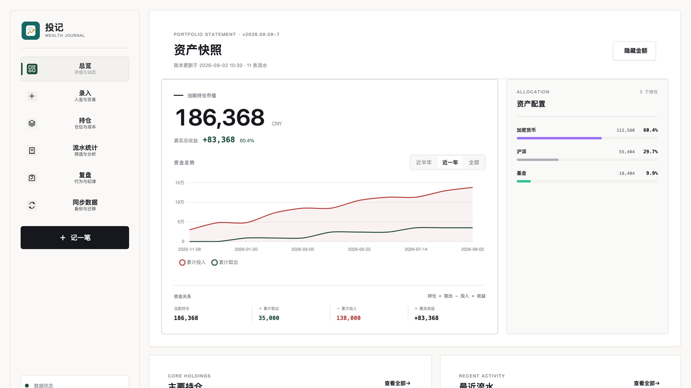
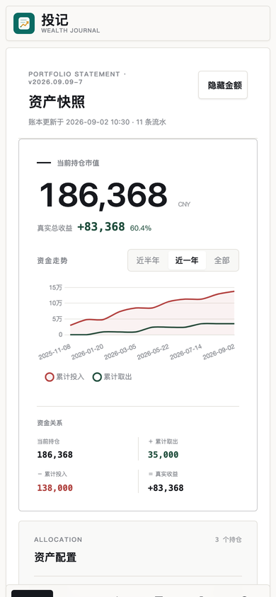
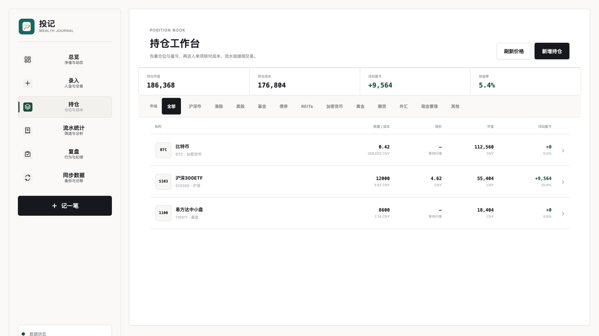

# 投记 Touji

> 本地优先的个人投资账本：记录资金流与交易流，追踪持仓价值，看清真实净值。

[在线体验](https://stvictor-ai.github.io/FlowLedger/) · [功能介绍](#核心功能) · [多端同步](#github-gist-多端同步) · [迭代路线](#迭代路线)

投记是一款**本地优先**的个人投资记账工具。它帮你记录每一笔出入金和买卖操作，自动同步持仓数量与加权成本，实时拉取股票、基金、加密货币等资产价格，计算持仓浮盈与已实现盈亏，最终汇总出你的**真实净值与收益率**。

它不是行情软件，也不替你下单。投记更像一个安静的投资账本：让你知道自己投了多少、取出了多少、手里还值多少。

---

## 产品预览

> 以下页面均使用匿名演示数据，不包含真实账户或个人投资记录。

### 桌面端



### 移动端与持仓

| 移动端总览 | 持仓管理 |
|---|---|
|  |  |

---

## 项目亮点

- **统一净值视角**：将入金、出金、持仓市值和已实现盈亏放在同一套计算模型中
- **资金流与交易流分层**：入金 / 出金负责本金变化，买入 / 卖出负责仓位与成本变化
- **本地优先**：不注册也能使用，账本默认只保存在当前浏览器
- **多资产、多币种**：覆盖沪深市、美股、港股、加密货币、基金、黄金和期货
- **多端同步但不自建后端**：借助用户自己的 Private Gist 完成电脑与手机同步
- **完整数据生命周期**：导入预览、撤销导入、自动快照、JSON 备份和冲突合并
- **轻量静态工程**：Vue 3 CDN 驱动，无构建步骤，可直接部署到静态托管
- **响应式产品界面**：桌面侧栏、平板顶部导航、手机底部 Tab，并支持三套主题

---

## 核心功能

### 出入金记账

- 记录向投资账户的每一笔**入金 / 出金**
- 支持多资产类型：沪深市、美股、港股、加密货币、基金、黄金、期货、其他
- 支持多币种：CNY、USD、HKD、USDT，自动折合 CNY
- 标签系统：可给每笔记录打上 `定投`、`补仓`、`FOMO` 等行为标签，便于统计和复盘
- 桌面端表格内联编辑，手机端弹出 Modal 编辑

### 买卖交易与持仓管理

- 记录**买入 / 卖出**交易，自动更新持仓数量和**加权均价**
- 卖出时自动计算**已实现盈亏**（(卖出价 − 均价) × 数量）
- 每条持仓实时拉取最新报价（沪深股票、港股、美股、基金、加密货币）
- 持仓配置甜甜圈图，直观展示各标的市值占比
- 点击持仓可展开关联的买卖流水明细
- 支持代码 / 中文名搜索（接入东方财富数据），也可手动填写自定义标的

### 真实净值计算

```
真实净值 = 已出金 + 当前持仓市值 − 已入金
真实收益率 = 真实净值 ÷ 已入金 × 100%
已实现盈亏 = 所有卖出记录的盈亏之和
```

与大多数记账软件不同，投记将**资金流（入金/出金）**与**交易流（买入/卖出）**分层处理，确保统计数据不相互污染。

### 盈亏统计

- 总览：总入金、总出金、已实现盈亏、持仓市值、真实净值、真实收益率
- 周 / 月 / 年周期盈亏统计，含环比对比和累计盈亏
- 月度趋势折线图，支持按入金、出金、净盈亏、累计查看
- 本年汇总：本年入金、本年出金、本年净额、累计净额
- 按资产类型、账户、行为标签三个维度分别统计

### 行为建议与复盘

- 自动识别投入行为模式（入金间隔、密集投入次数、最大单笔等）
- 生成心理画像标签和针对性建议
- 默认聚焦近 90 天，也可切换近 30 天、近 180 天或今年
- 交易日历可浏览任意历史月份，按天查看流水、交易和复盘笔记
- 行为时间线自动把近期操作与触发的规则关联起来
- 自动规则信号：大额资金变动、FOMO、亏损卖出、短期密集买入、单一持仓集中
- 每条信号都会显示触发原因和当前阈值，规则只做提醒，不替用户判断交易对错
- 支持周期复盘笔记与独立的每日复盘笔记
- 流水或持仓变化后，规则由浏览器本地实时重算，不需要人工或 AI 二次加工

### 界面主题

- 支持雾白、岩灰、墨金三套主题
- 主题选择保存在浏览器本地，刷新后自动恢复
- 现代财富工作台视觉：深青绿品牌色、重点收益区、分层数据卡片及移动端专属布局
- 投记专属账本图标与全端统一线性导航图标
- 桌面端使用可收起主题菜单，移动端使用紧凑主题弹层，减少常驻控件干扰
- 页面切换、菜单和提示采用轻量动效，并遵循系统的“减少动态效果”设置

### 数据管理与同步

- 数据存储在浏览器 **localStorage**，完全离线可用
- **Excel 导入导出**（含入金、出金、买卖、全部流水、月度统计多个 Sheet）
- **JSON 备份导入**，支持合并或覆盖两种模式
- 导入前预览：自动识别新增、更新、完全重复和无效行，确认后再合并
- 导入历史：保留最近 20 次导入批次，可一键撤销
- 完整快照（流水、持仓和删除记录，最多 6 份）+ 手动快照 + 一键恢复
- **GitHub Gist 云同步**：数据存入你的 Private Gist，免费、带版本历史、多端共享

---

## 快速开始

### 方式一：直接打开（最简单）

下载整个目录后打开 `index.html` 即可。首次加载 CDN 依赖需要联网；通过 HTTPS 部署并成功打开一次后，PWA 缓存可用于离线访问。

### 方式二：部署到静态托管

直接将整个目录部署到 GitHub Pages、Netlify 或 Vercel。

**GitHub Pages 示例：**

```bash
git clone https://github.com/stvictor-ai/FlowLedger.git
cd FlowLedger
# 推送到 GitHub 后，在仓库 Settings → Pages 开启即可
```

### 方式三：手机 PWA

1. 手机浏览器打开部署后的页面
2. Safari 点击底部分享按钮 → **添加到主屏幕**
3. Chrome / Edge 点击菜单 → **安装应用** 或 **添加到主屏幕**
4. 从主屏幕打开，像原生 App 一样全屏使用，支持离线访问

---

## GitHub Gist 多端同步

投记的同步方案将数据存入你自己的 **Private Gist**，而不是公开仓库，安全且带版本历史。

**配置步骤：**

1. 打开 [GitHub Token 设置页](https://github.com/settings/tokens/new)
2. Note 随意填写（如 `touji-sync`），Expiration 按使用周期选择（建议设置有限有效期）
3. 权限只勾选 `gist`，生成并复制 Token
4. 打开投记 → 右上角同步设置 → 粘贴 Token
5. **第一台设备**：点击「上传云端」完成初始化
6. **其他设备**：填入同一 Token → 点击「拉取云端」自动发现 Gist

之后每次打开自动静默拉取，也可手动点击「一键同步」双向合并（本地优先，按 `updatedAt` 时间戳去重）。

> Token 只保存在你本地浏览器的 localStorage 中，不会写入代码仓库。

---

## 数据模型

### 记录（entry）

```js
{
  id,            // UUID
  date,          // "YYYY-MM-DD"
  amount,        // 原始金额（数字）
  rate,          // 对 CNY 汇率（空 = 1）
  exchange,      // 账户 / 平台名称
  note,          // 备注
  type,          // "入金" | "出金" | "买入" | "卖出"
  assetType,     // "沪深市" | "美股" | "港股" | "加密货币" | "基金" | "黄金" | "期货" | "其他"
  currency,      // "CNY" | "USD" | "HKD" | "USDT"
  tags,          // 行为标签数组，如 ["定投", "FOMO"]
  // 买入/卖出专用字段
  tradeQty,      // 成交数量
  tradePrice,    // 成交单价（原始币种）
  targetSymbol,  // 标的代码
  targetName,    // 标的名称
  positionId,    // 关联的持仓 ID
  realizedPL     // 已实现盈亏（仅卖出记录，CNY）
}
```

### 持仓（position）

```js
{
  id,            // UUID
  symbol,        // 代码（如 "600519"、"BTC"）
  name,          // 名称（如 "贵州茅台"）
  qty,           // 持有数量
  avgCost,       // 加权均价（原始币种）
  currency,      // "CNY" | "USD" | "HKD" | "USDT"
  assetType,     // 资产类型
  source,        // "eastmoney" | "binance"
  secid,         // 东方财富行情 ID（用于拉取实时价格）
  icon,          // 可选图标
  origin,        // "manual" | "trade"
  updatedAt      // 多端同步冲突判断时间
}
```

---

## 技术栈

| 技术 | 用途 |
|------|------|
| Vue 3 (CDN) | 响应式 UI 框架 |
| Chart.js (CDN) | 月度趋势图、持仓配置图 |
| SheetJS/xlsx (CDN) | Excel 导入导出 |
| Day.js (CDN) | 日期处理 |
| localStorage | 本地数据持久化 |
| GitHub Gist API | 云端多端同步 |
| PWA (manifest + sw.js) | 离线缓存与主屏幕安装 |
| 东方财富 API | 股票 / 基金实时报价与搜索 |
| Binance API | 加密货币实时报价 |

以 `index.html` 为入口，核心复盘计算已拆分为独立 JavaScript 模块。项目无构建工具、无需安装依赖，可直接部署。

---

## 项目结构

```
FlowLedger/
├── index.html        # Vue 主应用与界面
├── js/
│   └── review-engine.js  # 无框架依赖的复盘规则、日历与时间线引擎
├── tests/
│   └── review-engine.test.js  # Node 内置测试运行器测试
├── docs/plans/       # 重要功能的实施计划
├── manifest.json     # PWA 配置
├── sw.js             # Service Worker 离线缓存
├── icon-192.png      # PWA 图标
├── icon-512.png      # PWA 图标
├── icon.svg          # 图标源文件
├── screenshots/      # 匿名演示数据生成的 README 截图
├── deploy.sh         # 可选服务器部署脚本
└── README.md
```

---

## 产品理念

> 投资的本质是把钱交给时间。记账的本质是把感觉交给数字。

投记的核心原则：

- **数据自主**：数据存在你自己的浏览器里，同步也是你自己的 Gist，投记不碰你的数据
- **两层分离**：现金流（入金/出金）和交易流（买入/卖出）独立统计，净值算得准
- **轻量优先**：单文件、无后端、无账号注册，下载即用

---

## 隐私与安全

- 流水、持仓、同步配置默认存储在当前浏览器的 `localStorage`
- 只有主动使用 Gist 同步时，账本数据才会发送到用户自己的 Private Gist
- GitHub Token 只保存在配置它的浏览器中，不写入仓库或导出的业务数据
- README 截图来自匿名演示账本，不包含作者的真实账户、持仓或流水
- 公开演示前可开启“隐藏金额”，避免在屏幕分享时暴露真实数值

> 浏览器本地数据仍可能因清理缓存或更换设备而丢失，请定期下载 JSON 备份。

---

## 迭代路线

### P0 · 先把账算得更稳

- 为净值、加权成本、卖出盈亏、导入合并和同步冲突补齐自动化测试
- 为 localStorage 数据模型增加显式版本号和可回滚迁移
- 增加行情源健康检查、失败提示、缓存价格与备用报价源
- 在已拆出的 `review-engine.js` 基础上，继续拆分计算、存储、同步、行情和 UI 模块
- 接入 GitHub Actions，自动执行语法检查、核心测试和 Pages 部署验证

### P1 · 补齐专业投资指标

- 增加 XIRR 资金加权收益率和 TWR 时间加权收益率
- 支持沪深 300、标普 500、比特币等基准对比
- 记录手续费、税费、分红、利息和资产转移
- 展示目标配置、实际配置与仓位偏离提醒
- 增加净值曲线、最大回撤、波动率和月度收益热力图

### P2 · 让复盘真正有用

- 支持自定义复盘模板、投资规则与执行评分
- 在现有五类规则信号上增加连续追高、计划偏离和仓位变化趋势
- 将每日复盘笔记纳入可选的多端同步与 JSON 备份
- 提供隐私模式下可分享的只读复盘卡片

### P3 · 从个人工具走向公共产品

- 保留本地模式，同时提供可选账号系统和加密云同步
- 将 GitHub Token 配置升级为更友好的 OAuth 授权流程
- 支持多账本、多投资组合和家庭资产视图
- 完成中英文界面、无障碍与键盘操作
- 增加隐私友好的错误监控与匿名产品指标
- 发布稳定版本、变更日志、贡献指南和公开产品路线图

### 推荐顺序

下一阶段建议先完成 **自动化测试 + 数据迁移 + XIRR/TWR**。这三项既能降低账本类产品最关键的数据风险，也最能体现项目在求职作品中的工程深度。账号系统、AI 建议和更多行情源可以放在核心账务可靠之后。

---

## License

MIT
